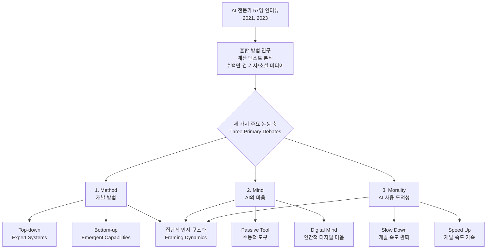

# Method, Mind, and Morality: How People Make Sense of Artificial Intelligence

## 원본 논문

**Method, Mind, and Morality: How People Make Sense of Artificial Intelligence** — [arXiv 원문](http://arxiv.org/abs/2608.24748v1)

## 빠른 시작

```bash
uv sync
uv run pytest -q               # 테스트 실행
uv run jupyter notebook demo.ipynb   # 결과 시각화 노트북 열기
```

## 논문 핵심 내용

이 연구는 급속도로 발전하고 있는 인공지능(AI) 시대에 인간이 어떤 인지적 장치를 통해 AI를 이해하고 해석하는지, 즉 '의미 구성(sensemaking)'의 동역학을 분석하는 사회과학적 연구입니다. 연구진은 2021년과 2023년 두 시점, AI 전문가 57명을 대상으로 반구조화된(semi-structured) 인터뷰를 실시하고, 여기에 AI 관련 신문 기사 및 소셜 미디어 게시물 수백만 건에 대한 계산 텍스트 분석(computational text analysis)을 결합한 혼합 방법(mixed-methods) 설계를 적용했습니다. 특히 2021년은 최근 대중적 관심이 급등하기 전, 2023년은 그 이후인 시점으로 설정하여, AI에 대한 사회적 인식 변화의 전후를 비교하는 데 초점을 맞췄습니다.

기존의 AI 해석 연구들은 주로 기술적 성능이나 윤리적 원칙에 국한되었거나, 정량적 여론 조사에 의존하여 집단적 인지 구조가 어떻게 형성되고 변형되는지에 대한 깊은 통찰을 제공하지 못했습니다. 이 논문이 지적하는 기존 접근의 핵심 한계는, AI에 대한 인식이 단일한 고정된 의견이 아니라, 상호 경쟁하고 융합하는 여러 '프레임(frame)'을 통해 동적으로 구성됨을 간과했다는 점입니다. 여기서 프레임이란 집단적 인지를 구조화하는 해석적 스키마(interpretive schema)를 의미하며, 사람들은 복잡한 AI 현상을 직면할 때 이러한 프레임을 사용하여 책임 소재 배분이나 사회적 영향력 평가 같은 심각한 인지적 과제(cognitive challenges)를 해결합니다.

논문의 핵심 기여는 AI 전문가들이 사용하는 이러한 사회학적 프레임들을 세 가지 주요 논쟁 축(debates)으로 체계화한 것입니다. 첫째, AI 개발의 '방법(method)'에 대한 논쟁으로, 상향식(top-down) 전문가 시스템 프레임과 하향식(bottom-up) 발생적 능력(emergent capabilities) 프레임 간 대립을 제시합니다. 이는 AI의 능력이 인간이 명시적으로 프로그래밍한 것에서 오는지, 아니면 모델 규모와 학습 데이터에서 자연스럽게 발생하는지라는 근본적인 질문을 제기합니다. 둘째, AI 시스템의 '마음(mind)'에 대한 논쟁으로, AI를 수동적 도구(passive tool)로 보는 시각과 인간에 가까운 '디지털 마음(digital mind)'으로 인식하는 시각 간의 스펙트럼을 파악합니다. 셋째, AI 사용의 '도덕성(morality)'에 대한 논쟁으로, 특히 AI 개발의 속도를 늦추어야 할지 가속화해야 할지에 대한 결정이 어떻게 프레임에 따라 정당화되거나 비판되는지를 분석합니다.

이 연구는 인간이 변형적 AI(transformative AI) 시대로 진입함에 따라 기술자와 정책입안자가 반드시 고려해야 할 사항을 드러냅니다. 우리의 믿음, 가치, 그리고 행동은 이러한 프레임 동역학(framing dynamics)에 의해 제약되고 형성되므로, 단순한 기술적 대응을 넘어 AI에 대한 사회적 해석의 구조를 이해하는 것이 필수적임을 강조합니다. 즉, AI의 기술적 발전 속도 자체보다, 그 발전을 해석하는 사회적 메커니즘이 어떤 방향으로 이동하고 있는지 모니터링하는 것이 미래 정책 수립과 기술 거버넌스에서 더 큰 중요성을 가질 수 있음을 시사합니다.



## 구현 설명

이 논문의 핵심은 자연어 텍스트에서 '프레임(frame)'과 '논쟁 축(debate axis)'을 추출하여, 텍스트가 어떤 인지적 범주에 속하는지 정량적으로 분석하는 것입니다. 실제 논문에서 사용된 수백만 건의 데이터 처리 파이프라인을 재현하는 것은 계산 비용이 크므로, 여기서는 소규모 텍스트 코퍼스를 대상으로 프레임 분류 및 논쟁 축 매핑을 수행하는 개념적 구현을 설계합니다.

구현의 첫 단계는 '프레이밍 텍스트 생성기'의 시뮬레이션입니다. 실제 신문 기사나 소셜 미디어 데이터를 직접 크롤링하는 대신, 논문에 제시된 3가지 축(Method, Mind, Morality)과 각각의 하위 프레임(예: 'Top-down Expert System', 'Emergent Capability')에 부합하는 문장을 템플릿 기반으로 생성하거나, 공개된 작은 뉴스 데이터셋에서 키워드 필터링을 통해 관련 문장을 추출합니다. 각 문장은 '소스(Source)', '본문(Text)', '시간(Year)' 메타데이터를 포함합니다.

두 번째 단계는 '프레임 감지 및 축 매핑 알고리즘'입니다. 각 텍스트를 분석하여 3가지 논쟁 축 중 어느 축에 가장 관련이 높은지, 그리고 그 축 내에서 어떤 하위 프레임(예: Method 축에서 Top-down인지 Bottom-up인지)에 해당하는지 판단합니다. 이를 위해 사전에 정의된 키워드 기반의 규칙 엔진(rule-based engine) 또는 가벼운 NLP 토크나이저를 활용합니다. 예를 들어, 텍스트에 'programming', 'rule-based', 'logic'이 포함되면 Method 축의 'Top-down' 프레임 점수를 높이고, 'emergent', 'large scale', 'surprise'가 포함되면 'Bottom-up' 프레임 점수를 높입니다. 이 과정은 각 축별로 독립적으로 점수를 산출하는 구조로 설계됩니다.

세 번째 단계는 '프레임 동역학 시각화 데이터 준비'입니다. 연도(2021, 2023)를 기준으로 분류된 텍스트들의 프레임 점수 분포를 집계합니다. 특정 연도에서 'Bottom-up' 프레임이 'Top-down'보다 얼마나 더 많이 등장하는지, 또는 'Digital Mind' 프레임과 'Passive Tool' 프레임의 비율 변화가 어떻게 나타나는지 계산합니다. 이 단계에서는 단순한 빈도 계산뿐만 아니라, 텍스트의 감정 분석(정서 분석)과 결합하여 프레임이 긍정적으로 언급되는지 부정적으로 언급되는지를 추가로 파악하는 로직을 포함할 수 있습니다. 이는 논문의 'Frames are adopted and contested'라는 부분을 구현하는 데 중요합니다.

마지막으로, 분석 결과는 구조화된 데이터 프레임 형태로 출력되며, 이는 나중에 시각화 차트(예: 시간 경과에 따른 프레임 점유율 변화 차트)를 생성하는 데 사용됩니다. 구현의 목표는 복잡한 심리학 이론을 코드로 변환하는 것이 아니라, 텍스트 데이터에서 논문의 3가지 축에 기반한 인식을 추출하고 정량화하는 파이프라인의 논리적 흐름을 검증하는 것입니다.

## 논문 ↔ 코드 매핑

| 논문 부분 | 구현 위치 (함수/클래스) | 비고 |
|---|---|---|
| Section: Data & Methodology (Interviews & Text Analysis) | `load_and_preprocess_text_data()` | 텍스트 데이터 로드 및 전처리(토큰화, 정화) |
| Section: Three Primary Debates (Method, Mind, Morality) | `FRAME_DEFINITIONS` (상수/딕셔너리) | 3가지 축 및 하위 프레임의 키워드/규칙 정의 |
| Section: Frames as Interpretive Schemas | `analyze_frame_scores()` | 텍스트별 프레임 점수 계산 로직 (규칙 기반 또는 유사도 계산) |
| Section: Sensemaking Dynamics (Temporal Changes) | `aggregate_frame_trends()` | 연도별/기간별 프레임 점유율 및 변화 추이 집계 |
| Section: Cognitive Challenges (Responsibility, Ethics) | `identify_contention_points()` | 프레임 간 충돌/경쟁 상황을 식별하는 로직 (선택적) |
| 전체 파이프라인 | `run_sensemaking_analysis()` | 메인 실행 함수: 데이터 로드 -> 분석 -> 결과 출력 |

## 실행 방법과 예상 출력

구현이 완성되면, 다음과 같은 순서로 실행하게 됩니다.

1.  **데이터 준비**: `data/sample_ai_articles.csv` 파일을 생성합니다. 이 파일에는 `id`, `year` (2021 또는 2023), `text` 컬럼이 포함되며, 각 행은 AI와 관련된 짧은 뉴스 헤드라인 또는 본문 발췌문입니다. 예를 들어, 2021년 데이터는 "AI systems must be programmed with explicit ethical rules"와 같은 Top-down 프레임에 부합하는 텍스트를, 2023년 데이터는 "GPT models exhibit surprising emergent behaviors not in their training data"와 같은 Bottom-up/Emergent 프레임에 부합하는 텍스트를 포함하도록 구성합니다.
2.  **실행**: `python main.py`를 실행합니다.
3.  **예상 출력**:
    *   콘솔에 각 샘플 텍스트에 대한 프레임 분석 결과가 출력됩니다.
        ```
        [2021] "AI systems must be programmed with explicit ethical rules"
          - Method: Top-down Expert Systems (Score: 0.85)
          - Mind: Passive Tool (Score: 0.60)
          - Morality: N/A (Score: 0.00)
        ```
    *   전체 데이터셋에 대한 집계 결과가 출력됩니다.
        ```
        === Frame Dynamics Summary ===
        Period: 2021
          - Dominant Method Frame: Top-down Expert Systems (45.0%)
          - Dominant Mind Frame: Passive Tool (60.0%)
        Period: 2023
          - Dominant Method Frame: Bottom-up Emergent Capabilities (55.0%)
          - Dominant Mind Frame: Digital Mind (50.0%)
        
        Change in Dominance (2021 -> 2023):
          - Method: Shift from Top-down to Bottom-up (+10% net shift)
          - Mind: Shift from Passive Tool to Digital Mind (-10% net shift)
        ```
4.  **테스트 실행**: `test_main.py`를 실행하여 특정 키워드가 포함된 텍스트가 올바른 프레임에 매핑되는지, 연도별 집계 계산이 수학적으로 정확한지 단위 테스트를 수행합니다. 예를 들어, 'emergent' 키워드가 포함된 텍스트는 Method 축에서 Bottom-up 점수가 반드시 0 이상이어야 하는지 확인합니다.

## 한계

1.  **정량적 분석의 깊이 부족**: 이 구현은 규칙 기반(keyword-based) 또는 매우 단순한 NLP 기법을 사용합니다. 실제 논문에서는 수백만 건의 텍스트에 대한 복잡한 계산 텍스트 분석(computational text analysis, 예: LDA, BERT embeddings 등)을 활용했을 가능성이 높습니다. 단순 키워드 매칭은 문맥적 뉘앙스, 아이러니, 또는 복합적인 프레임 조합을 포착하지 못합니다.
2.  **데이터 대표성 부족**: 구현에 사용되는 샘플 데이터는 실제 뉴스나 소셜 미디어의 복잡성과 노이즈를 반영하지 않습니다. 실제 데이터에서는 프레임이 명확히 구분되지 않거나, 하나의 텍스트에 여러 프레임이 혼재되는 경우가 많으므로, 이 단순 모델의 정확도는 프로덕션 수준에서 의의를 찾기 어렵습니다.
3.  **시간적 동역학의 단순화**: 연도(2021, 2023) 두 지점만 비교하므로, 그 사이의 연속적인 변화나 급격한 전환점(tipping point)을 미세하게 추적하지 못합니다.
4.  **인과관계 추론 불가능**: 이 코드는 프레임의 '존재'와 '빈도'를 분석할 뿐, 프레임이 어떻게 '도입(adopted)'되고 '경쟁(contested)'되는지에 대한 인과적 메커니즘을 모델링하지 않습니다. 논문이 강조하는 '동역학(dynamics)'의 심층적 부분은 이 간이 구현에서는 빠져 있습니다.
5.  **사회학적 맥락 누락**: 코드 분석만으로는 인터뷰에서 드러난 전문가들의 개인적 경험, 감정적 반응, 또는 조직적 맥락과 같은 질적 데이터의 풍성함을 재현할 수 없습니다.


---
*생성: qwen3.8-27b (qwen-local)*
