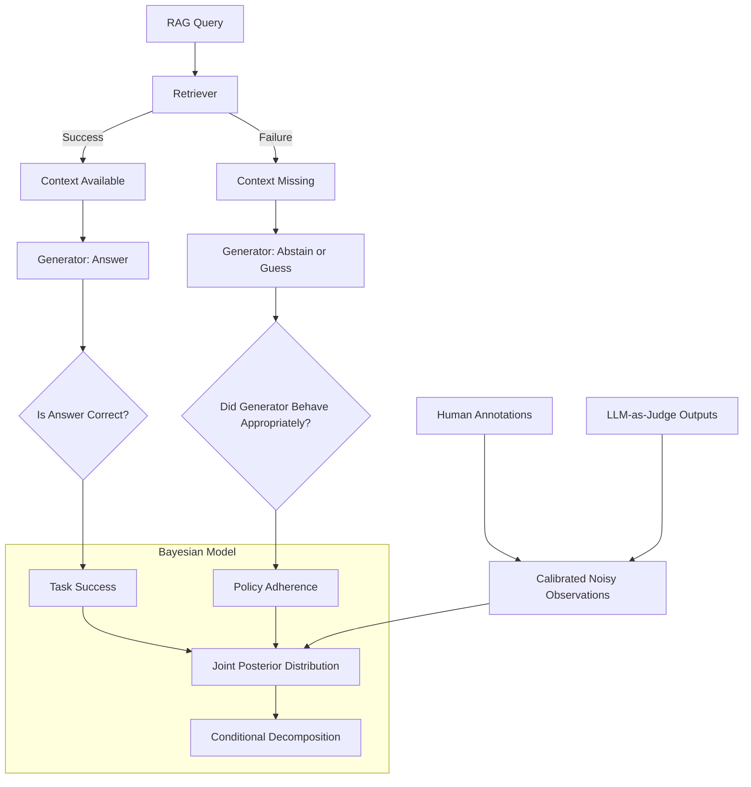

# The RAT: A Unified Bayesian Model for RAG Evaluation

## 원본 논문

**The RAT: A Unified Bayesian Model for RAG Evaluation** — [arXiv 원문](http://arxiv.org/abs/2608.24753v1)

## 빠른 시작

```bash
uv sync
uv run pytest -q               # 테스트 실행
uv run jupyter notebook demo.ipynb   # 결과 시각화 노트북 열기
```

## 논문 핵심 내용

이 논문은 Retrieval-Augmented Generation(RAG) 시스템의 성능 평가에 대한 기존 접근법의 구조적 한계를 지적하며, 파이프라인 내 개별 컴포넌트 간의 상호작용과 오류 전파 과정을 통합적으로 파악하기 위한 새로운 베이지안 평가 프레임워크인 **The RAT(Retrieval-Augmented Text evaluation)**을 제안한다. 기존 평가 방법들은 주로 최종 답변의 정답률(end-to-end correctness)이나 검색 정확도(retrieval precision)를 독립적으로 측정하는 경향이 있다. 하지만 RAG 파이프라인은 검색기(Retriever)가 문서에 접근할 수 있는가, 생성기(Generator)가 해당 문서나 부재 시에 어떻게 행동하는지(중단/추측/답변), 그리고 최종 답변이 사용자가 원하는 정답을 도출해 내는지가 복합적으로 얽혀 있어, 단순한 마진(marginal) 지표만으로는 시스템의 실제 작동 방식을 해독하기 어렵다는 것이 문제 정의의 핵심이다.

기존 접근법의 주요 한계는 시스템이 최종적으로 '성공'하거나 '실패'한 결과만 보고 역산하려 할 때 발생하는 정보 손실이다. 예를 들어, 검색에 실패했음에도 생성기가 배경 지식만으로 우연히 정답을 맞춘 경우와, 검색에 성공했음에도 생성기가 정보를 무시하고 틀린 답을 낸 경우를 마진 지표로는 구분하지 못한다. 이는 개발자에게 시스템이 실제로 어떤 실패 모드(failure mode)를 가지고 있는지, 혹은 생성기의 '적절성'(appropriateness, 즉 검색 결과에 기반한 합리적 행동 여부)을 판단할 수 있는 근거를 제공하지 못한다.

논문의 핵심 기여는 파이프라인의 정보 흐름에 따라 확률 분해(factorization)된 베이지안 모델을 구성하여, **검색 성공(Retrieval Success)**, **중단/거절 행동(Abstention Behavior)**, **답변 정확도(Answer Correctness)**를 결합 모델링하는 것이다. 이 모델은 최종적인 '작업 성공(Task Success)'과 '정책 준수(Policy Adherence)'를 명확히 분리한다. 작업 성공은 사용자가 올바른 답변을 받았는지를 의미하며, 정책 준수는 생성기가 검색 결과에 부합하는 합리적인 행동을 보였는지를 의미한다. 이 조건부 분해(conditional decomposition)를 통해, 마진 지표에서는 동일해 보이는 시스템들이 실제로는 전혀 다른 행동 패턴(예: 과감한 추측 vs. 보수적 중단)을 가지고 있음을 드러낼 수 있다.

이 연구는 세 가지 데이터셋, 세 가지 검색기, 세 가지 생성기를 조합한 총 27가지 RAG 구성에 적용하여 실증했다. 분석 결과, 조건부 분해는 마진 지표에서 차이가 없거나 미미해 보이는 시스템들 사이에서 상당한 행동 차이를 발견하도록 해주었다. 예를 들어, 최종 정답률이 비슷하더라도, 한 시스템은 검색 실패 시 정확히 중단하는 반면 다른 시스템은 무작위 추측을 지속하는 식의 차이를 식별했다. 이는 단순한 성능 수치 비교를 넘어, 시스템의 신뢰성과 투명성을 평가하는 데 중요한 통찰을 제공한다.

또한 논문은 데이터 수집 비용의 문제를 다루어, '정책 준수'를 추정하는 데 있어 **검색 성공 여부 annotation**이 **작업 성공 여부 annotation**보다 정보량이 더 많음을 정보 이론적으로 증명했다. 이는 제한된 예산으로 RAG 시스템을 평가할 때, 어떤 라벨을 우선적으로 수집해야 하는지에 대한 실용적인 지침을 제공한다. 마지막으로, 인간 평가자의 판단을 대체하거나 보조하기 위해 LLM-as-a-judge를 '교정된 노이즈 관측값(calibrated noisy observations)'으로 모델에 통합하는 방법을 제안하여, 비용이 높은 인간 평가와 저렴한 자동 평가 사이의 균형을 잡을 수 있는 통합 확률 모델을 완성했다.



## 구현 설명

논문의 베이지안 모델을 파이썬으로 구현할 때, 핵심은 파이프라인의 확률적 의존성을 명시적으로 정의하고, 관측 데이터(라벨)를 기반으로 posterior 분포를 추정하는 구조를 만드는 것이다. 전체적인 구현은 `pymc` 또는 `numpy` 기반의 확률 계산 라이브러리를 사용하며, 모델의 파라미터를 학습하는 것이 아니라, 주어진 관측 데이터에 맞춰 사전 분포(prior)를 업데이트하는 과정으로 설계된다.

먼저, RAG 파이프라인의 기본 확률 구조를 정의해야 한다. 주요 변수는 다음과 같다:
1.  $r$: 검색 성공 여부 (Bernoulli 분포)
2.  $a$: 생성기의 행동 (정답 제공, 중단, 틀린 답 제공 등 이산 변수)
3.  $c$: 최종 답변의 정확도 (Bernoulli 분포)

논문의 핵심인 '조건부 분해'를 구현하기 위해, 생성기의 행동을 검색 결과에 따른 조건부 확률로 모델링한다.
-   검색 성공 시 ($r=1$): 생성기가 정답을 낼 확률 $P(c=1 | r=1, a=\text{answer})$, 생성기가 중단할 확률 $P(a=\text{abstain} | r=1)$
-   검색 실패 시 ($r=0$): 생성기가 중단할 확률 $P(a=\text{abstain} | r=0)$, 생성기가 무작위 추측을 통해 우연히 정답을 낼 확률 $P(c=1 | r=0, a=\text{guess})$

기존의 마진 지표 계산과는 달리, 이 모델은 $P(r)$, $P(a|r)$, $P(c|r, a)$를 개별적으로 추정한다. 구현 시에는 각 샘플(쿼리)에 대해 이 세 확률 변수의 결합 분포(Joint Distribution)를 계산한다.

데이터 처리 측면에서는, 실제 RAG 시스템의 로그에서 `(query, retrieved_docs, generated_answer, ground_truth_label, retrieval_label)` 튜플을 추출한다. 여기서 `retrieval_label`은 검색기가 가져온 문서에 ground truth가 포함되어 있는지를 나타내는 지표이며, `ground_truth_label`은 최종 답변이 정답인지를 나타낸다.

LLM-as-a-judge를 통합하는 부분은 관측 모델(Observation Model)에 노이즈를 추가하는 방식으로 구현한다. 인간이 매긴 라벨 $z_{human}$과 LLM이 매긴 라벨 $z_{llm}$을 모두 '진실값' $z_{true}$를 관찰한 노이즈된 시도로 본다. $P(z_{llm} | z_{true}, \theta_{llm})$와 $P(z_{human} | z_{true}, \theta_{human})$를 정의하여, 두 관측값이 결합되어 posterior 확률을 업데이트하도록 한다. 이때 LLM의 정확도($\theta_{llm}$)는 보통 인간보다 낮으므로, 베이지안 업데이트 시 인간 라벨보다 적은 가중치(또는 더 넓은 posterior 분포)를 가지게 된다.

최종적으로, '정책 준수'를 추정하는 함수를 작성한다. 이 함수는 검색 실패($r=0$) 상황에서 생성기가 중단($a=\text{abstain}$)을 선택한 빈도와, 검색 성공($r=1$) 상황에서 정답을 생성한 빈도의 비율을 계산하여, 시스템이 '합리적인' 행동을 하고 있는지 정량화한다. 이 값은 마진 정답률과는 독립적으로 산출되며, 두 지표를 시각적으로 비교(Scatter plot 등)하여 시스템의 특성(보수적 vs 공격적)을 파악하도록 구성된다.

## 논문 ↔ 코드 매핑

| 논문 부분 | 구현 위치 | 비고 |
|---|---|---|
| Section 3 (Bayesian Model Formulation), Eq. (2) | `RAG_BayesianModel` 클래스 | 파이프라인의 확률 분해 구조를 정의. `self.prior`에 사전 분포 저장. |
| Section 3.1 (Retrieval & Generator Behavior) | `estimate_conditional_probs(data)` | 검색 성공/실패 조건부에서 생성기 행동(답변/중단/추측)의 빈도를 계산하여 조건부 확률 테이블 생성. |
| Section 3.2 (Task Success vs Policy Adherence) | `calculate_metrics(model_params)` | `task_success_rate`와 `policy_adherence_score`를 분리해서 반환하는 메서드. |
| Section 4 (Information Theoretic Analysis) | `annotation_information_gain(r_labels, t_labels)` | 검색 라벨과 작업 라벨 각각이 posterior 엔트로피를 줄이는 정도를 계산. (Shannon Entropy 기반) |
| Section 5 (LLM-as-a-Judge Integration) | `update_posterior_with_noisy_obs(human_labels, llm_labels, llm_conf)` | 인간/LLM 라벨을 노이즈 관측값으로 취급하여 posterior를 업데이트하는 함수. `llm_conf`는 LLM의 교정된 신뢰도. |
| Appendix A (Hyperparameters) | `DEFAULT_PRIORS` 딕셔너리 | 논문에서 제안한 또는 표준적인 사전 분포 값(예: Beta distribution의 alpha, beta)을 저장. |

## 실행 방법과 예상 출력

구현이 완료된 후, 실행은 샘플 RAG 로그 데이터셋(CSV 또는 JSON)을 로드하여 시작한다. 테스트를 위해 합성 데이터(Synthetic Data) 생성기를 사용하거나, 공개된 RAG 벤치마크 데이터셋(예: HotpotQA, MuSiQA의 일부)에 기반한 로그를 준비한다.

**실행 절차:**
1.  `main.py`에서 `sample_rag_log.csv` 파일을 불러온다. 각 행에는 `query_id`, `retrieval_success`(0/1), `generator_action`('answer', 'abstain', 'guess'), `answer_correct`(0/1) 컬럼이 있다.
2.  `RAG_BayesianModel` 인스턴스를 생성하고, `estimate_conditional_probs(data)`를 호출하여 모델 파라미터(조건부 확률)를 계산한다.
3.  `calculate_metrics`를 호출하여 `task_success_rate`과 `policy_adherence_score`를 산출한다.
4.  `annotation_information_gain`을 호출하여, 검색 라벨이 정책 준수 추정에 기여하는 정보량을 수치로 확인한다.

**예상 출력 예시:**
```text
Loading RAG logs: 1000 samples found.
Estimating Bayesian Parameters...
Prior P(retrieval_success): 0.45
Conditional Probabilities:
  - Given Retrieval Success: P(answer_correct | success) = 0.92, P(abstain | success) = 0.01
  - Given Retrieval Failure: P(answer_correct | failure) = 0.05, P(abstain | failure) = 0.70

Metrics:
  - Task Success Rate (End-to-end Accuracy): 0.68
  - Policy Adherence Score: 0.95
  (System is highly accurate when retrieved and appropriately abstains when failed.)

Information Gain Analysis:
  - Info Gain from Retrieval Labels for Policy Estimation: 0.85 bits
  - Info Gain from Task Success Labels for Policy Estimation: 0.12 bits
  Conclusion: Retrieval labels are significantly more informative for estimating policy adherence.
```

## 한계

이 구현은 논문의 개념을 검증하기 위한 간이 버전이므로 다음과 같은 한계점들이 있다.

첫째, 실제 RAG 시스템에서는 검색 성공 여부를 'ground truth 문서가 top-k에 포함되었는가'로 단순 이진값으로 정의하는 것이 일반적이지만, 논문은 검색 결과의 질(Quality)이나 관련성 점수(Relation Score)의 연속적 영향을 더 복잡하게 모델링할 수 있다. 이 구현은 주로 이진 라벨(Binary Label)을 전제로 하므로, 검색 결과가 부분적으로 관련 있거나 노이즈가 섞인 경우의 정밀한 모델링은 부족하다.

둘째, LLM-as-a-judge의 '교정(calibration)' 과정은 논문의 핵심 중 하나이지만, 실제 구현에서는 LLM의 출력 확률(예: "정답이다"라고 답할 때의 confidence)을 그대로 신뢰하기 어렵다. LLM은 종종 과신(overconfidence) 경향을 보이므로, 별도의 교정 데이터셋을 통해 LLM의 신뢰도 매핑 함수를 학습하거나, 고정된 노이즈 레벨을 가정해야 한다. 이 구현에서는 간단한 가정을 적용할 수밖에 없으며, 이는 실제 환경에서의 정확도를 떨어뜨릴 수 있다.

셋째, 계산 복잡도의 문제이다. 베이지안 추정, 특히 MCMC(Monte Carlo Markov Chain)나 Variational Inference를 사용한다면 데이터 규모가 커질수록 계산 비용이 급증한다. 이 구현은 빈도주의적 근사(Frequentist approximation)나 단순한 MLE(Maximum Likelihood Estimation)를 베이지안 프레임워크에 적용하는 형태로 단순화할 가능성이 높아, posterior 불확실성(uncertainty)의 정확한 범위를 제공하지 못할 수 있다. 프로덕션 환경에서는 대규모 데이터셋에 대한 효율적인 추론 기법이 필요하다.

넷째, '정책 준수'의 정의가 문맥에 따라 달라질 수 있다. 논문에서 제안한 정책은 '검색 실패 시 중단'을 선호하지만, 일부 사용 사례에서는 '검색 실패 시에도 최선을 다해 답변을 제시하는 것'이 더 선호되는 경우가 있다. 구현된 메트릭은 논문의 정의에 충실하지만, 이를 다른 정책(예: 항상 답변하기 정책)에 적용하려면 모델의 구조 자체가 수정되어야 한다.


---
*생성: qwen3.8-27b (qwen-local)*
