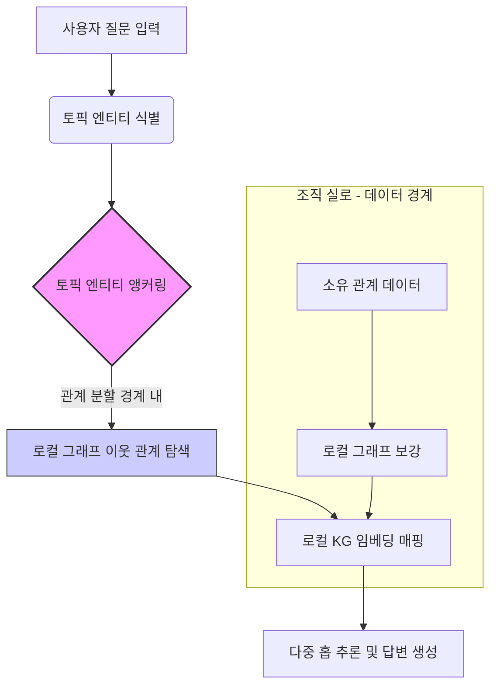

# FedV-KGQA: Multi-Hop Question Answering over Vertically Partitioned Knowledge Graphs

## 핵심 아이디어 한 줄 요약
조직 간 데이터 주권 보호를 위해 지식 그래프의 '관계'를 수직 분할한 환경에서, 원본 삼중지(triple)가 외부로 유출되지 않으면서도 여러 단계에 걸친 복합 질문(Multi-Hop)에 답변할 수 있도록 로컬 그래프 보강과 토픽 엔티티 앵커링을 결합한 연산 방식이다.

## 구현 설명
FedV-KGQA는 중앙 집중식 서버가 전체 그래프를 소유하지 않고, 각 조직(실로, Silo)이 특정 관계만 소유하는 수직 분할 구조를 전제로 한다. 구현의 핵심은 '데이터 경계 유지'와 '추론 경로 탐색'의 분리다.

첫째, 로컬 그래프 보강(Local Graph Enrichment) 단계에서 각 조직은 자신이 소유한 관계 데이터만 활용하여 로컬 그래프의 밀도를 높인다. 이는 다른 조직의 데이터가 필요한 다중 홉 질문에 대비하기 위함이다. 둘째, 지식 그래프 임베딩(KG Embeddings)을 사용하여 엔티티와 관계를 벡터 공간으로 매핑한다. 이때 중요한 것은 원본 삼중지나 관계 파라미터가 네트워크를 통해 전송되지 않고, 각 실로 내에서 처리된다는 점이다. 즉, 원문 데이터의 물리적 이동 없이 구조적 경계만 설정한다.

셋째, 토픽 엔티티 앵커링(Topic Entity Anchoring) 메커니즘을 적용한다. 사용자가 질문을 입력하면, 시스템은 질문의 핵심 주제가 되는 '토픽 엔티티'를 식별한다. 이 엔티티를 기준점으로 삼아, 해당 엔티티가 속한 그래프 이웃 관계(neighborhood)를 정확히 지시(grounding)한다. 이를 통해 런타임 동안 다른 실로와 실시간 통신을 하지 않고도, 질문이 필요한 그래프 영역을 추론할 수 있게 한다. 최종적으로는 이 앵커링된 이웃 정보와 로컬 임베딩을 조합하여 답변 엔티티를 산출한다.

## 실행 방법과 예상 출력
시스템은 3개의 벤치마크 데이터셋을 사용하여 12가지 모델 구성으로 평가된다. 실행 시나리오는 다음과 같다.

1.  **데이터 분할 설정**: 지식 그래프를 관계별로 수직 분할하여 3개 이상의 가상 조직으로 나누고, 각 조직은 자신의 관계만 노출한다.
2.  **모델 학습 및 앵커링**: 각 조직이 로컬 데이터를 기반으로 임베딩 모델을 학습하고, 토픽 엔티티 앵커링 모듈을 초기화한다.
3.  **추론 요청**: "A의 부모의 친구는 누구인가?"와 같은 3-hop(3단계) 질문에 대한 요청이 들어온다.
4.  **처리 과정**: 시스템은 'A'를 토픽 엔티티로 앵커링하고, A가 속한 조직의 로컬 그래프에서 A와 연결된 관계들을 탐색한다. 중앙 서버의 중재나 다른 조직과의 실시간 데이터 교환 없이, 앵커링된 이웃 정보와 임베딩 유사도를 계산하여 답변을 도출한다.

**예상 출력**:
*   **정확도**: 중앙 집중식 시스템(Centralized System)의 성능에 근접하는 수준의 정답률을 보인다. 특히 다중 홉 질문에서 분할된 데이터의 단절을 극복하고 정확한 엔티티를 반환한다.
*   **3-hop 일반화**: 2-hop까지 학습된 모델이 3-hop 질문에도 잘 일반화되는 것을 확인한다.
*   **내성 테스트**: 임베딩 벡터에 노이즈(교란)를 추가했을 때도 답변의 정확도가 크게 떨어지지 않는다는 결과가 나온다. 이는 토픽 엔티티 앵커링이 그래프 구조적 정보를 잘 활용하고 있음을 의미한다.

## 한계
간이 구현 또는 해당 프레임워크가 실제 프로덕션 환경에서 완전한 해결책이 되기 어려운 이유와 실제 논문 및 상용 시스템과의 차이점이다.

1.  **실시간 동기화 부재**: 런타임 간 실로 간 통신이 없으므로, 한 조직의 데이터가 변경되었을 때 다른 조직의 추론 결과에 즉시 반영되지 않는다. 이는 데이터 일관성(Currency) 문제가 발생할 수 있음을 의미한다.
2.  **토픽 엔티티 식별 의존성**: 질문의 핵심이 되는 '토픽 엔티티'를 정확히 식별하지 못하면, 앵커링이 잘못된 그래프 이웃으로 지시되어 추론 경로가 끊어질 수 있다. 자연어 이해(NLP) 단계에서 엔티티 추출의 정확도가 전체 시스템의 상한선(bottleneck)이 된다.
3.  **관계 분할의 경계 문제**: 질문이 필요로 하는 관계가 특정 조직에 없거나, 관계가 매우 희소(sparse)하게 분할된 경우, 로컬 그래프 보강만으로는 충분한 밀도를 확보하기 어려울 수 있다.
4.  **보안과 프라이버시의 트레이드오프**: 원본 삼중지는 전송되지 않지만, 임베딩 벡터나 앵커링 과정에서 중간 표현이 노출될 수 있다. 악의적인 공격자가 임베딩 공간에서 엔티티를 역추적(Inversion Attack)할 가능성은 이 프레임워크 자체로는 해결하지 않는다.
5.  **확장성의 한계**: 수직 분할된 조직이 매우 많거나, 그래프가 거대할 경우, 토픽 엔티티 주변에 필요한 관계가 여러 조직에 걸쳐져 있을 때, 로컬 보강만으로는 성능 저하가 예상된다. 중앙 집중식 시스템이 가진 전역 가시성(Global Visibility)의 부재는 근본적인 한계로 남는다.

---
*생성: qwen3.8-27b (qwen-local)*
