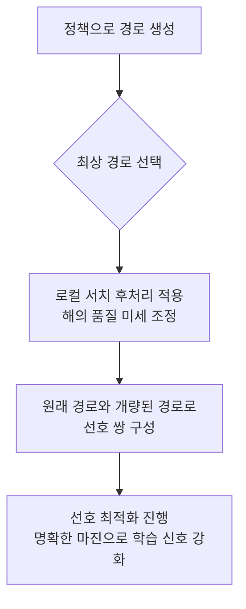
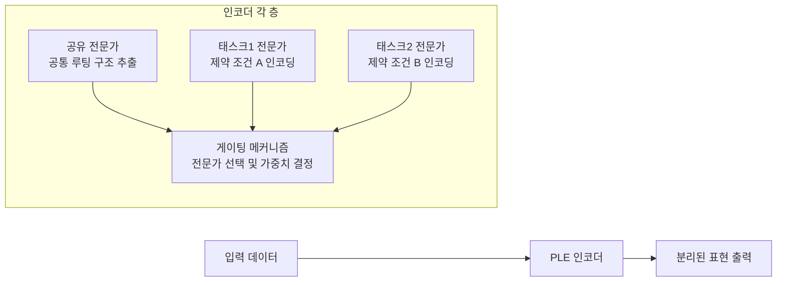

# Improving Cross-Problem Vehicle Routing with Locally Augmented Preferences and Representation Disentanglement

## 핵심 아이디어 한 줄 요약
강화학습과 기존 선호 최적화의 '약한 서포지션' 문제와, 다중 태스크 학습 시 발생하는 인코더 표현의 '엉킴' 현상을 동시에 해결하여, 신경망을 활용한 다중 태스크 차량 경로 문제(VRP) 해결기의 성능과 일반화 능력을 크게 향상시킨다.

## 구현 설명
이 논문은 문제의 근본적인 두 가지 취약점을 타겟으로 하는 모델 무관(model-agnostic)한 두 가지 기법을 제안한다.

첫째, 훈련 알고리즘의 개선인 **POLAR(Preference Optimization with Locally Augmented Refinement)**이다. 기존 선호 최적화(Preference Optimization) 방식은 정책이 생성한 두 해(solution)의 차이(마진)가 너무 작아지거나(거의 동일한 경로), 보상의 규모가 서로 달라서 학습 신호가 약해져서(신호의 축소) 학습이 정체되는 문제를 안고 있다. POLAR은 이 문제를 해결하기 위해, 정책이 디코딩한 최상의 경로를 선택한 후, 이 경로에 **로컬 서치(local search)**라는 후처리 단계를 적용한다. 로컬 서치는 해의 품질을 미세 조정하는 기법으로, 이를 통해 형성된 선호 쌍(preference pairs)의 마진이 훨씬 명확해지고 정보량이 높아진다. 즉, "조금 더 좋은 해"와 "최상의 해"가 아니라, "원래 해"와 "로컬 서치로 개량된 해"라는 뚜렷한 격차를 만들어 학습 신호를 강화하는 것이다.

둘째, 아키텍처의 개선인 **PLE(Progressive Layered Extraction)** 인코더이다. 기존의 다중 태스크 VRP 모델은 모든 변형(variant)에 대한 인코더를 완전히 공유하기 때문에, 서로 다른 제약 조건들(예: 시간 창, 차량 용량 등)에 의존하는 표현이 뒤섞여(entangled) 버진다. 이로 인해 새로운 변형으로의 일반화(generalization)가 제한된다. PLE 인코더는 각 인코더 층(layer)에서 **공유 전문가(shared expert)** 와 **태스크별 전문가(task-specific expert)** 들로 구성되어 있다. 이 전문가들을 통과하는 과정에서, 공통적인 루팅 구조와 특정 제약 조건에 특화된 인코딩을 점진적으로 분리해 낸다. 이 분리 작업을 위한 결정은 **게이팅 메커니즘(gating mechanism)** 이 담당하며, 어떤 정보를 공유 전문가로, 어떤 정보를 특정 태스크 전문가로 보낼지 판단한다.

## 실행 방법과 예상 출력
구현이 완료된 이 신경망 모델은 다양한 VRP 변형 문제를 처리하는 데 사용된다. 실행은 다음과 같은 순서로 진행된다.

1.  **다양한 VRP 변형 데이터셋으로 훈련**: 16가지 분포 내(in-distribution) VRP 변형 문제를 포함한 데이터셋으로 모델을 훈련한다. 이 과정에서 POLAR 알고리즘이 로컬 서치를 이용해 선호 쌍을 만들고, PLE 인코더가 표현을 분리하며 학습이 진행된다.
2.  **새로운 문제에 대한 추론**: 훈련이 끝나면, 모델은 분포 내 문제뿐만 아니라, 32개의 분포 외(out-of-distribution, unseen) VRP 변형 문제에 대해서도 경로를 생성한다.
3.  **결과 측정 및 비교**: 생성된 경로 솔루션의 품질을 '참조 솔루션(reference solutions)'과의 차이(gap)로 측정한다.

예상되는 출력은 다음과 같은 구체적인 성능 향상이다.
*   **분포 내 16가지 VRP 변형**: 현재까지 발표된 가장 강력한 신경 기반 다중 태스크 해결기(baseline)와 비교하여, 참조 솔루션에 대한 평균 차이(gap)를 **21.3% 줄였다**. 이는 기존 방법론에서 달성했던 가장 큰 상대적 성능 향상 중 하나에 해당한다.
*   **분포 외 32가지 VRP 변형**: 기존 신경 기반 방법들이 우세하지 못했던 이 어려운 일반화 테스트에서, 32개의 unseen 변형 중 **27개**에서 더 나은 성능을 보였다. 이는 PLE 인코더가 표현을 분리함으로써 새로운 문제 유형에 대한 적응력이 크게 높아졌음을 시사한다.
*   **압연 연구(Ablation Studies) 결과**: POLAR와 PLE 두 기법이 각각 독립적으로도 성능을 향상시키며, 특히 POLAR가 학습 신호를 강화하고 PLE가 일반화 능력을 높이는 데 기여하는 것이 확인된다. 또한, 이 두 기법이 다양한 다른 백본 모델(backbone model architectures)에서도 일관되게 성능을 끌어올림을 보여, 특정 모델 구조에 종속되지 않는 범용성을 입증했다.

## 한계
이 논문의 기여는 명확하지만, 몇 가지 한계와 프로덕션 적용 시 고려해야 할 점이 있다.

*   **로컬 서치의 계산 비용**: POLAR의 핵심인 로컬 서치는 훈련 과정에서 매 단계마다 추가되는 계산 비용이다. 특히 대규모 문제나 많은 변형을 다룰 때, 이 후처리 단계가 전체 훈련 시간을 상당 부분 증가시킬 수 있다. 이는 실시간 또는 초고속 응답이 필요한 프로덕션 환경에서의 적용 가능성을 제한하는 요인이 될 수 있다.
*   **전문가 수와 복잡도**: PLE 인코더의 효과는 태스크별 전문가의 수와 게이트 메커니즘의 설계에 크게 의존한다. 변형의 수가 매우 많아지면 전문가의 수도 비례해 증가해야 할 수 있으며, 이는 모델의 크기와 복잡도를 높이고 과적합(overfitting)의 위험을 가져올 수 있다. 적절한 전문가 구성을 찾는 것도 별도의 최적화 문제가 된다.
*   **'최적'의 정의와 참조 솔루션**: 성능 평가의 기준이 되는 '참조 솔루션'의 품질에 따라 결과가 달라질 수 있다. 논문에서 사용한 참조 솔루션이 해당 문제의 절대적 최적해(global optimum)가 아니라, 특정 휴리스틱이나 메타휴리스틱으로 구해 낸 근사해(approximate solution)일 수 있다는 점을 인지해야 한다. 따라서 보고된 21.3%의 격차 감소는 이 특정 기준에 대한 상대적 개선일 뿐, 실제 물류 문제에서의 최종 비용 절감으로 직접 환산되지는 않는다.
*   **다중 목적 최적화 문제의 확장**: 현재 논문의 초점은 단일 목적(예: 최소 거리 또는 최소 비용)을 가진 VRP 변형들의 통합이다. 실제 물류에서는 비용, 시간, 탄소 배출량, 고객 만족도 등 여러 상충되는 목적을 동시에 최적화해야 하는 경우가 많다. 이 논문의 프레임워크가 이러한 복잡한 다중 목적 최적화 문제로 얼마나 잘 확장되는지는 추가적인 연구가 필요하다.

---
*생성: qwen3.8-27b (qwen-local)*
